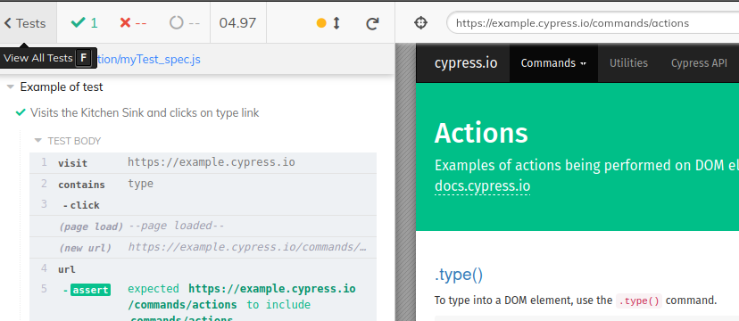

# **C Y P R E S S**

*Cypress*, framework para automatización de pruebas End to End basado en la sintaxis de MochaJs, chai(etc), escrito en JavaScript.

### Set up
Se ejecuta en Node por medio de su package manager NPM. El directorio del proyecto escribir:

```
    npm install cypress--save-dev
```
Para ejecutar:
```JS
    ./node_modules/.bin/cypress open

    //or
    npx cypress open
```

<br>

Cypress Interface


...