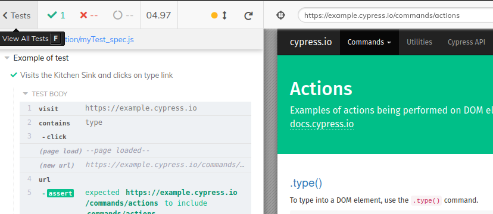
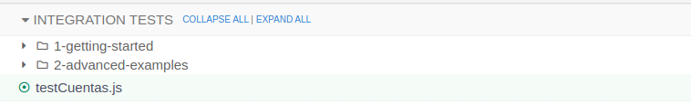
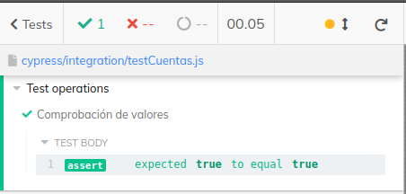
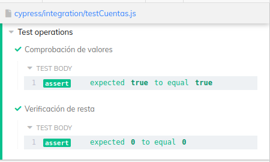

# **Set up**
<br>
Se ejecuta en Node por medio de su package manager NPM. El directorio del proyecto escribir:
<br><br>

```
    npm install cypress--save-dev
```
Para ejecutar:
```JS
    ./node_modules/.bin/cypress open

    //or
    npx cypress open
```

<br><br>

**Cypress Interface**<br><br>


---
<br>

## **Realización de tests**
En el directorio *Integration* crear un nuevo file _spec.js
<br><br>


**Estructura**<br>
Para hacer un grupo de casos de prueba usamos ***describe***
<br><br>

* Como primer parametro lleva una descripción del conjunto de pruebas
* En el segundo parametro lleva un función callback
* Dentro de la función se colocan los casos de prueba con ***it***
* ***It*** contiene una descripción in la prueba a realizar
<br><br>

```JavaScript

    describe('Test operations', function() {

        const a = -5 + 10;
        const b = 5
        
        // El paramatro de it es una descripción del caso de prueba
        it('Comprobación de valores', function() {
            //Se espera que la condición sea true
            expect(a === b).to.equal(true);
        })

    })
```
Cypress ejecuta el test al dar save<br><br>
<br><br>
Para ejecutar mas pruebas se agregan con ***it***<br><br>

```JavaScript

    describe('Test operations', function() {

        const a = -5 + 10;
        const b = 5
        
        // El paramatro de it es una descripción del caso de prueba
        it('Comprobación de valores', function() {
            //Se espera que la condición sea true
            expect(a === b).to.equal(true);
        });

        // Se agrega una segunda prueba
        it('Verificación de resta', function() {
            expect(a-b).to.equal(0);
        });

    })
```
**Output**<br><br>
