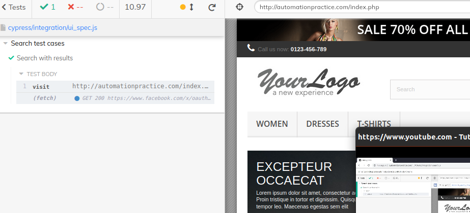
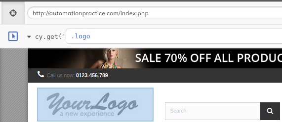

# **UI**

<br>

>* [Return to index](../README.md)


<br>
Para hacer tests el alguna app que ya se encuetre en produccion se puede visitar directamente con la URL.
<br><br>

```JS
     // Se realizara una test para realizar una busqueda en automationpractice.com
    // que contenga resultados
    describe('Search test cases', () => {

        // Para la mayoria de acciones se debe usar con CY
        // Para visitar se agrega la URL
        it('Search with results', () => {
            cy.visit('http://automationpractice.com/index.php');
        })
})
```
<br>

**Resultado**
<br><br>


---
<br>

## **cy.get()**<br>

Es la forma de de obtener los elementos de la pagina. Con  <span> </span>  en la UI de cypress es posible encontrar los selectores de los elementos.
<br><br>

<br>
*Obtención de el selector del logo*

<br>
Entonces para realizar un test para automatizar una busqueda que retorne resultados al string dress.<br><br>

```JS
    describe('Search test cases', function(){

        // Para la mayoria de acciones se debe iniciar con 'cy'
        // Para visitar se agrega URL para y se colocan las acciones.
        it('Search with results', function(){
            cy.visit('http://automationpractice.com/index.php');
            cy.get('#search_query_top').type('dress');
            cy.get('#searchbox > .btn').click();
            cy.get('.lighter').contains('"hat"');
        })
    })
```
En resumen 

* Usamos get() para encontrar un elemento
* Type() se usa para ingresar valores
* Click(), clickear
* Contains para asegurarnos de que existe algun valor
---

## Alternativas para encotrar elementos
<br>

Para realizar busquedas de elementos podemos usar otras propiedades, como por ejemplo las *clases* o el *name* en lugar del id. 
Es decir se puede usar cualquier propiedad para acceder al elemento.

Obtención de mismo elemento por propiedades
```JS
    describe('Ways find elements', () => {
        it('Looking for "search" element', () => {

            cy.visit('http://automationpractice.com/index.php');
            // busqueda por clase
            cy.get('.search_query.form-control.ac_input').type('green'); // by class
            cy.get('#search_query_top').type(' small'); // by id
            cy.get('[name="search_query"]').type(' dress'); // by name
            cy.get('[placeholder="Search"]').clear(); // by placehooder
        })
    })
```
