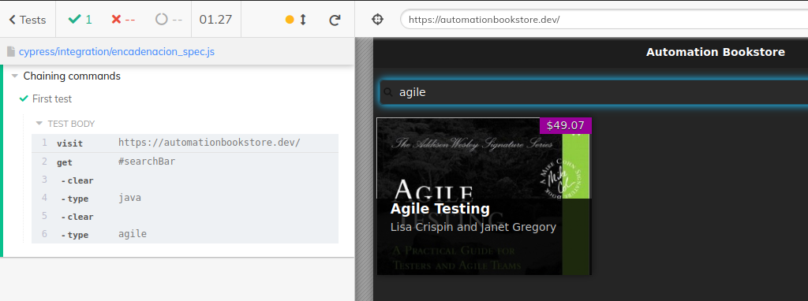
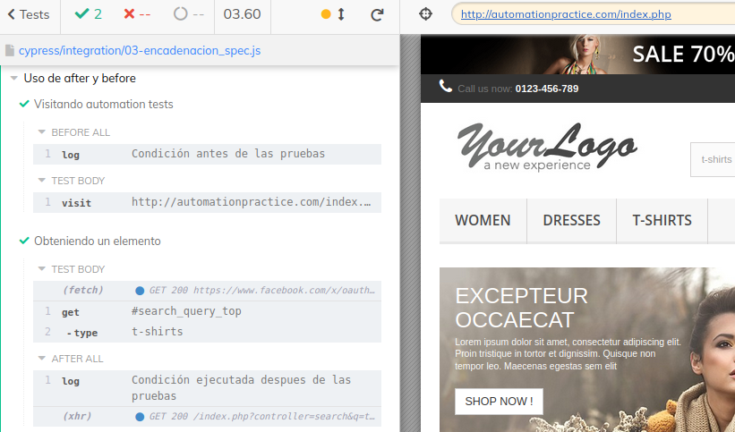
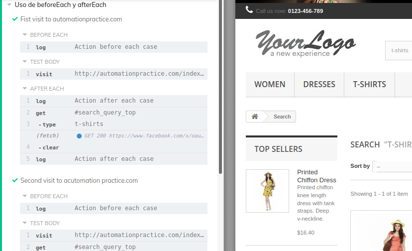

# Encadenación de comandos

El encadenamiento es útil para reducir la cantidad de lineas y limpieza de código.

>Por ejemplo

<br>

```JS
    describe('Chaining commands', () => {

        it('Searching for a book', () => {
            cy.visit('https://automationbookstore.dev/');

            // Al obtener un elementos se pueden encadenan distintas 
            // 'acciones' para realizar en el
            cy.get('#searchBar').clear().type('java').clear().type('agile');
        })
    })
```


<br><br>
# **After y Before**
Se usan cuando necesitamos realizar acciones antes y despues de realizar las pruebas, como por ejemplo poblar una base de datos, etc. <br>Usando de  ejemplo http://automationpractice.com/index.php

* before <br>
  Se ejecuta antes de todas los casos de pruebas
* after<br>
  Se ejecuta al final de todos los casos de prueba.
<br>

>Ejemplo

```JS
// ...
        
        // Instrucciones antes y despues de todos los casos
        before( function(){
            cy.log('Condición antes de las pruebas');
        });
        after( function(){
            cy.log('Condición ejecutada despues de las pruebas');
        });

        // Casos
        it( 'Primer caso', () => {
            cy.visit('http://automationpractice.com/index.php');
        });

        it('Segundo caso', () => {/*...*/});

//...
```
<br>


<br><br>


**BeforeEach y afterEach**
---
---
Se usan para realizar acciones antes y/o después de cada prueba.<br><br>
```JavaScript
//...

    //Pre-condiciones para cada caso
    beforeEach( () => {
        cy.log('Action before each case');
    });
    afterEach( () => {
        cy.log('Action after each case');
    });

    // Casos
    it('Fist visit to automationpractice.com ', () => {
        cy.visit('http://automationpractice.com/index.php')
            .get('#search_query_top')
            .type('t-shirts')
            .clear();
    });
    it('Segundo caso', () => {/*...*/}

//...
```
<br><br>
**Salida**

