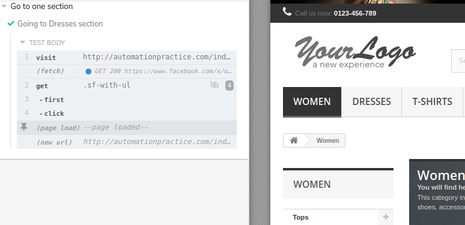

# **Checkboxes**

>* [Return to index](../README.md)

<br>


Suponiendo que se requiere entrar a una seccion de alguna pagina y realizar interacciones como por ejemplo clickear algunas opciones en elementos checkbox, etc., en cypress se puede usar el comando  ```check()``` para seleccionar las casillas.

```JS
    describe('Pruebas en seccion "women"', () => {

        beforeEach( () => {
            cy.visit('http://automationpractice.com/index.php?id_category=3&controller=category');
        });

        it( 'Select large tops', () => {
            cy.get('#layered_category_4').check();
        });
    })
```
**Tambien se puede usar ```click()```*
<br><br>
**Salida**

<br><br>
Para limpiar las selecciones se usa ```uncheck()```.

```JS
    cy.get('#layered_category_4').uncheck();
```
<br>

# **Selects**
Si se quiere manipular algun drop-list para seleccionar algun valor podemos usar ```select()``` .
<br><br>
>Por ejemplo tenemos esta lista desplegable y queremos probar obtener los articulos con mayor precio.<br>


Entonces usamos
```JS
//...
        it('Ordenar articulos por precio', () => {
            cy.get('#selectProductSort').select('Price: Highest first');
        })
//...
```
Si la prueba es exitosa obtenemos


<br><br>

# **Seleccionar el primer elemento de un conjunto de elementos**

Cuando hay una coleccion de elementos que comparten clase por ejemplo puede ocasionar que sea difícil obtener o seleccionar uno solo elemento en particular ya que no poseen una propiedad en particular.
<br><br>


>Por ejemplo en la siguiente barra las tres secciones comparten una misma clase, por lo que si seleccionamos una sola clase se obtendra un error.


<br>

Para solucionar esto se puede especificar la posición con por ejemplo ```.first()``` para clickear en el elemento.
<br>

```JS
    describe('Go to one section', () => {

        it('Going to Dresses section', () => {
            cy.visit('http://automationpractice.com/index.php');
            cy.get('class=sf-with-ul').first().click();
        })
```

**Salida**


---
<br>

# **Seleccionar cualquier elemento**
Para acceder a cualquier posición de un conjunto de elementos se puede usar ```eq.(index)``` colocando entre parentesis en indice al que se quiere accerder como si se tratara de un array.
<br><br>

```JS
    describe('Going to a particular section', () => {

        beforeEach( () => {
            cy.visit('http://automationpractice.com/index.php');
        })

        // Accediendo al elemento con indice 3
        it('Going to Dresses Section', () => {
            cy.get('.sf-with-ul').eq(3).click();  
        })
    })
```
