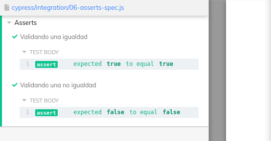
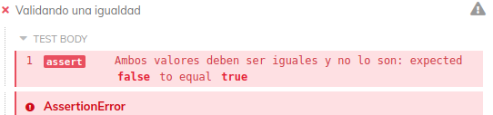

# **Asserts**

>* [Return to index](../README.md)

<br>


Cypress posee varias formas de realizar validaciones, varias de las cuales estan basadas en Chai.js
<br>

Una de las más importantes es ```expect()```

>Por ejemplo
```JS
    describe( 'Asserts', () => {

        it('Validando una igualdad', () => {
            expect(1 === 1).to.equal(true);
        })

        it('Validando una no igualdad', () => {
            expect(1 === 2).to.equal(false);
        }) 
    })
```
<br>



<br>

Cuando se quiera validar que una condición negativa, entonces se usa ```to.not.equal()``` en lugar de to.equal(), colocando entre parentesis el parametro.

```JS
    it('Validando una resta no correcta', () => {
        expect(1-1).to.not.equal(2);
    })
```

Otra forma de validar que una condición sea verdadera es ```expect().to.be.true``` (o .false en caso de que deba ser falso)


```JS
    it('Debe ser verdadero', () => {
        expect(2 == 2).to.be.true;
    })
```

O para validar si algun valor/elemento/variable existe se usa ```.exist```

```JS
    it('Validando si la variable existe', () => {
        expect(a).to.exist;
    })
```

Para validar que una variable es menor a un valor dado se usa ```to.be.lessThan( value )```. Por el contrario se usa ```.greaterThan()``` para validar que sea mayor

```JS
    const a = 10
    it('Es menor a 15', () => {
        expect(a).to.be.lessThan(15)
    })
```
<br><br>
# Descripión del fallos


```expect()``` acepta un segundo argumento, con una explicación del fallo o de la condición.
<br><br>

```JS
    it('Validando una no igualdad', () => {
        expect(1 === 2, 'Ambos valores deben ser iguales y no lo son').to.equal(false);
    }) 
```
<br>

