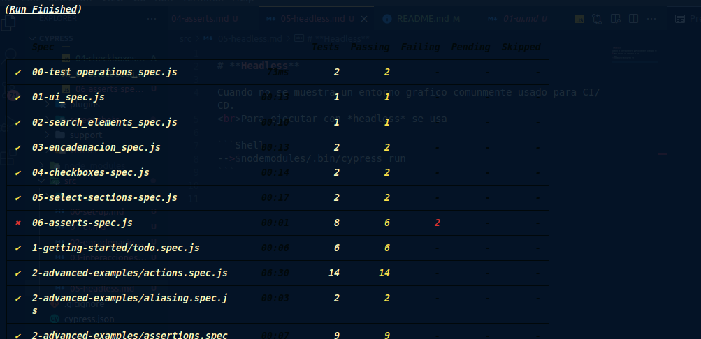
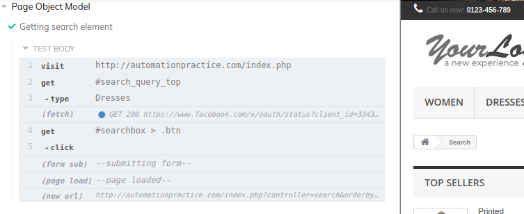
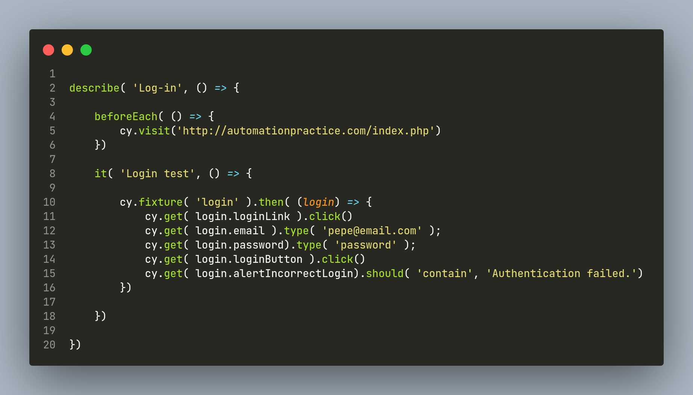
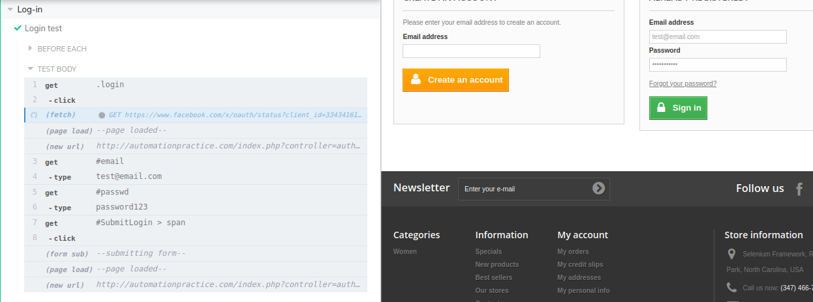

# **Headless**

>* [Return to index](../README.md)

<br>

Cuando no se muestra un entorno grafico comunmente usado para CI/CD.
<br>Para ejecutar con *headless* se usa

```Shell
-->$nodemodules/.bin/cypress run
```
<br>



<br>

# **Page Objects**

Son patrones que permiten una forma de ejecutar pruebas sobre los elementos de la pagina modelo reultilizando código fundamentado en considerar cada pagina de una webapp como una clase.

Por ejemplo si queremos reducir este código
```JS
    it('Second visit to acutomation practice.com', () => {
    
        cy.get('#search_query_top').type('t-shirts');
        cy.get('#searchbox > .btn').click();
    });
```

<br>

> Podemos crear las clase  ```./cypress/support/``` de la sig. forma y exportarla


```JS
    class indexPage {

        constructor() {
            this.searchInput = '#search_query_top';
            this.searchButton = '#searchbox > .btn';
        }

        // Las Interacciones se definen por lo métodos
        search = (element) => {
            cy.get(this.searchInput).type(element);
            cy.get(this.searchButton).click();

        }
    }

export default new indexPage();
```

<br>
Entonces se importa el módulo y será posible usar el metodo varias veces en distintos casos de prueba<br><br>


```JS
describe('Page Object Model', () => {

    it('Getting search element', () => {
        indexPage.search('Dresses');
        indexPage.search('Hat');
    })
})
```

<br>


<br><br>

# **Custom Commands**

Una alternativa a Page Objects son los *custom commands*. <br>
Para usarlos o crealos se añadir en el file ```./cypress/integration/support/commands.js``` de la siguiente forma.

```JS
    // El primer parametro es el nombre del commando
    // El segundo es argumento que recibe
    Cypress.Commands.add('logText', (textToLog) => {
        cy.log('*' + textToLog + '*');
    })
```

El cual ahora ya se puede usar como un comando normal en cualquier test.
```JS
    // Custom command
    describe('Using custom commands', () => {

        it('Printing messages', () => {
            cy.visit('http://automationpractice.com/index.php');

            // Comando creado
            cy.logText('Printing gomething random')
        })
    })
```
<br>

Podemos crear mas modulos de custom commands creaando un archivo en  **support** con los comandos que requeramos.<br>
Para poder usar estos comandos en cualquier lado *debemos importar el nuevo modulo desde index.js* que se encuentra tambien en **support**.

```JS
    // Index.js flle
    
    import './commands'
    import './login'

    // Alternatively you can use CommonJS syntax:
    // require('./commands')
```

Entonces podemos crear un nuevo archivo de comandos en support como por ejemplo: login.js

---

Suponiendo que creamos un login el cual se usa multiples veces donde se obtiene cada elemento usando fixtures.

<br>



Esto se puede facilitar usando un custom creado un custom command el cual reciba dos argumentos de email y password para usarlo multiples veces:

```JS
    Cypress.Commands.add( 'login', ( email, password ) => {

        cy.fixture( 'login').then( (login) => {
            cy.get( login.loginLink ).click()
            cy.get( login.email ).type( email );
            cy.get( login.password).type( password );
            cy.get( login.loginButton ).click()
        })

    })
```

Y entonces en el caso de prueba solo invocamos estas funciones con los valores que queramos probar.

```JS
    it( 'Login test', () => {

        cy.login( 'test@email.com', 'password123'); 

    })
```

<br>



